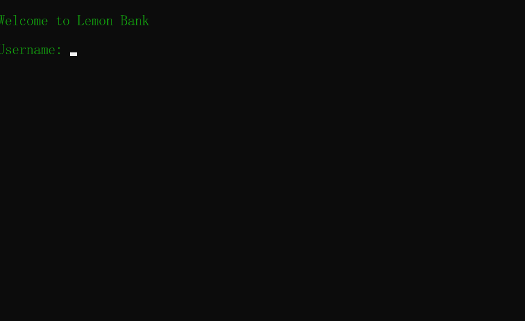
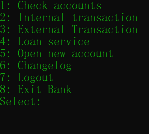

# Lemon Bank
A simple bank app made with .NET Core 3.1

## Table of Contents
* [General info](#general-info)
* [Technologies](#technologies)
* [Flow of control](flow-of-control)
* [Setup](#setup)
* [Program Flow](#program-flow)
* [Classes](#classes)
* [Kanban Board](#kanban-board)

## General info
This project is a simple bank app where the user can create new accounts, check current accounts,
take a loan, open a savings account and transfer to other users in the bank.

## Technologies
Project created with:
.NET Core 3.1.
C# 8.0.

# Flow of control
The app is built so users can handles currencies in different ways and admins can change exchange rates and create new users.
We have choosen to use dictionaries and List<T> for our database and user records, a feature that could be improved with the use of a real database instead like SQL. Since we use dictionaries and lists we have made them as static properties so we can save changes in the bank even when we logout and change user as if we were to use objects it would only be temporary.

In our app we have one big base class called "Person" that has all the attributes a person regardless of user or admin could inherit.
We then have our 2 sub-classes which are "User" and "Admin" and those have specific properties and methods depending on their role.
We try to use objects for new users, accounts, loans and collections to set each object to a specific instance and in this way making it easier to locate and handle each induvidual object.

Most ways to identifie a specific user or account we use the users ID to set a key for each item we are looking for. This makes things like user-specific account and loans much easier since we now have a target instead of looking in the entire list every time.

When we create new users we give them a unique account ID with the use of GUID [Globally Unique Identifier](https://en.wikipedia.org/wiki/Universally_unique_identifier) that lets us give the user the possibility to create new accounts without having to worry about the same ID turning up twice.

## Setup

```
$ cd ../debug
$ TeamLemon.exe
```

# Program Flow
The program is built so when we first start it up we are greated with a ASCII logo of our bank. Then the user is asked to login with their username and password:


After this the user is sent to the menu where they can select many different options:



# Classes
* [Login](#login)
* [Menu](#menu)
* [Account Managment](#account-managment)
* [Loan Managment](#loan-managment)
* [Account](#account)
* [Admin](#admin)
* [Loan](#loan)
* [Person](#person)
* [User](#user)
* [Changelog Managment](#changelog-managment)


## Login
This is our login class that handles the basic login functions with username and password validation.
The admin also goes through the same login class and at the end we check if the user is an admin or normal user.

## Menu
This is the menu class. Here the user or admin gets to choose where to go next in the program depending on their role.
The user have many choices to pick and the admin have the basic functions of creating a new user and changing exchange rates.

## Account Managment
In our account managment class we have the methods to allow the user to do different things on their accounts such as
monotoring their account balances:
```
  public static void MonitorAccounts(User currentUser)
  
```
In this class we have built a structure with methods either handling basic functions the user want's to do but also the private methods that handles things like password-checks, error handling with amounts of currency transferable and also account index verification.

## Loan Managment
In this class we handle user loan commits. Here we mainly have only one method the user interacts with and the rest are checks and verification methods. We also calculate the users loan-celling in this class with the method:

```
public decimal CalculateLoanCelling(User currentUser)
        {
            Account.AllAccounts.TryGetValue(currentUser.ID, out List<Account> accounts);
            decimal loanCelling = 0;
            Loan.AllLoans.TryGetValue(currentUser.ID, out Loan currentLoan);
            if(currentLoan != null)
            {
                return currentUser.AmountLeftToLoan;
            }
            foreach (Account account in accounts)
            {
                if(account.Culture.Name == "en-US")
                {
                    loanCelling += account.Balance / Admin.usdValue;
                }
                else
                {
                    loanCelling += account.Balance;
                }            
            }
            loanCelling *= 5;
            return loanCelling;
        }
        
```
## Account
This is only a model class that have the properties for the account objects we use in all the parts of user currency account handling.
Each account have the following properties:

```
        public string AccountName { get; set; }
        public decimal Balance { get; set; }
        public string AccountID { get; set; }
        public decimal interest = 1.2m;
        public CultureInfo Culture { get; set; }

        public static Dictionary<int, List<Account>> AllAccounts { get; set; } = new Dictionary<int, List<Account>>();
        public static Dictionary<int, List<Account>> AllSavings { get; set; } = new Dictionary<int, List<Account>>();
        
```
## Admin
The admin class have some basic properties such as a List<T> of all admins and also an decimal variable which defines the exchange rate between SEK and USD. The Admin class also has the "CreateNewUser" method for creating new users of the bank.
Here we can create new objects of type "User" and add them to the bank record. The admin class also contains a method that allows the admin to change the current exchange rate.

## Loan
The loan class is just a model class for when a user takes a loan. We then use this class to create an objact of it with the properties "Amount" and "User" to see how much the user loaned and also which user took the loan. Also in this class there is a static Dictionary of all current loans at the bank so we can keep track of them.

## Person
Person is our base model class for both user and admin. This class contains all the attributes a person regardless of their current role at the bank. The user class looks as following: 

```
    public class Person
    {
        private string _name;
        private string _password;
        private bool _admin;
        private int _id;
        private int _logInAttempt;
        private bool _lockedUser;
        private List<Account> _accounts;
        private List<Account> _savingsAccounts;
        public string Name { get => _name; set { _name = value; } }
        public string Password { get => _password; set { _password = value; } }
        public bool IsAdmin { get => _admin; set { _admin = value; } }
        public int ID { get => _id; set { _id = value; } }
        public int LogInAttempt { get => _logInAttempt; set { _logInAttempt = value; } }
        public bool LockedUser { get => _lockedUser; set { _lockedUser = value; } }
        public List<Account> Accounts { get => _accounts;set { _accounts = value; } }
        public List<Account> SavingsAccounts { get => _savingsAccounts; set { _savingsAccounts = value; } }
    }
    
```

## User
Our user class mostly serves as a model class were User inherit the person class to get all the properties of a person for each user in the bank. The user itself contains a List<T> of all our users in the bank and also a properties for their induvidual loan limit so we can keep track of each persons current limit. Both in the user class and the admin class we have a initializer-method to create our base-users/admins for our program so we have some users and admins to test the app with.

## Changelog Managment
The changelog displays the users interactions in the bank. We use methods async to write new text files that are saved in ID-specific folders for each user with changes and transactions the user makes on their accounts. We display the time and date the transactions are made with DateTime struct and append to each textfile when the user does something. An internal transaction for example is displayed as following: 


# Kanban Board
[Board](https://trello.com/invite/b/Nt94vdm8/ATTIb781d433bf0768c1790c0f900bca1011C36FC94A/team-lemon)
